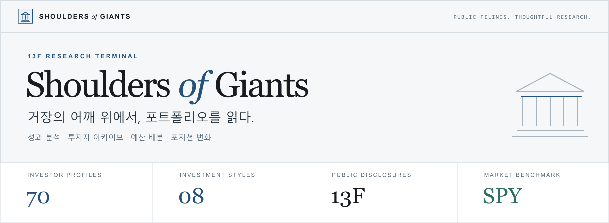
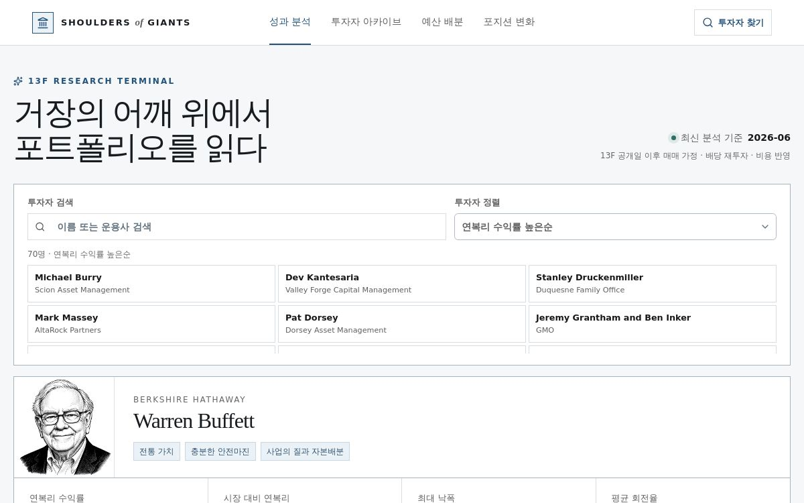

<p align="center">
  
</p>

<p align="center">
  <a href="https://shoulders-of-giants.onb1321.chatgpt.site"><strong>사이트 둘러보기 ↗</strong></a>
  &nbsp; · &nbsp;
  <a href="#주요-화면">주요 화면</a>
  &nbsp; · &nbsp;
  <a href="#투자자-아카이브">투자자 아카이브</a>
  &nbsp; · &nbsp;
  <a href="#시작하기">시작하기</a>
  &nbsp; · &nbsp;
  <a href="#데이터와-방법론">데이터와 방법론</a>
</p>

---

**거장의 투자 철학부터 포트폴리오의 변화까지.**

Shoulders of Giants는 공개된 SEC Form 13F 자료를 바탕으로 투자자의 보유 종목과 투자 성향, 복제 포트폴리오의 성과를 살펴보는 한국어 리서치 사이트입니다. 투자자를 찾아 시장과 비교하고, 직접 입력한 예산으로 배분을 시뮬레이션하며, 분기 사이의 포지션 변화를 읽을 수 있습니다.

## 주요 화면

<a href="https://shoulders-of-giants.onb1321.chatgpt.site">
  
</a>

<p align="center"><sub>옅은 회색 바탕, 절제된 파란색과 초록색, 펜 초상과 데이터 차트로 구성한 리서치 화면.</sub></p>

| 화면 | 살펴볼 수 있는 내용 |
| :--- | :--- |
| **[01 · 성과 분석 ↗](https://shoulders-of-giants.onb1321.chatgpt.site)** | 13F 복제 포트폴리오와 SPY의 성장 경로, 연복리 수익률, 최대 낙폭, 회전율, 최근 보유 비중 |
| **[02 · 투자자 아카이브 ↗](https://shoulders-of-giants.onb1321.chatgpt.site/investors)** | 투자자·운용사 검색, 스타일 필터, 성과·위험·보유 종목 수에 따른 정렬과 투자자별 상세 리포트 |
| **[03 · 예산 배분 ↗](https://shoulders-of-giants.onb1321.chatgpt.site/allocator)** | 직접 입력한 달러 예산, 투자자 포트폴리오와 컨센서스 모델, 시장 레짐을 반영한 정수 주식 수량과 잔여 현금 |
| **[04 · 포지션 변화 ↗](https://shoulders-of-giants.onb1321.chatgpt.site/changes)** | 신규·전량매도·확대·축소·유지 구분, 종목 검색, 비중 변화와 변경 요약 |

## 투자자 아카이브

**70명의 투자자, 8가지 투자 스타일.** 아래는 아카이브에서 만날 수 있는 대표 인물입니다.

<table>
  <tr>
    <td align="center" width="25%">
      <a href="https://shoulders-of-giants.onb1321.chatgpt.site/investors/berkshire"></a><br />
      <strong>Warren Buffett</strong><br />
      <sub>전통 가치 · Berkshire Hathaway</sub>
    </td>
    <td align="center" width="25%">
      <a href="https://shoulders-of-giants.onb1321.chatgpt.site/investors/pershing_square"></a><br />
      <strong>Bill Ackman</strong><br />
      <sub>행동주의 · Pershing Square</sub>
    </td>
    <td align="center" width="25%">
      <a href="https://shoulders-of-giants.onb1321.chatgpt.site/investors/fundsmith"></a><br />
      <strong>Terry Smith</strong><br />
      <sub>퀄리티 복리 · Fundsmith</sub>
    </td>
    <td align="center" width="25%">
      <a href="https://shoulders-of-giants.onb1321.chatgpt.site/investors/duquesne"></a><br />
      <strong>Stanley Druckenmiller</strong><br />
      <sub>글로벌 매크로 · Duquesne</sub>
    </td>
  </tr>
</table>

전통 가치 · 행동주의 · 가치·매크로 혼합 · 퀄리티 복리 · 딥밸류·부실 · 펀더멘털 성장 · 글로벌 매크로 · 이벤트·매크로

## 시작하기

**Node.js 22.13.0 이상**과 npm이 필요합니다.

```bash
git clone https://github.com/lht1321/ShouldersOfGiants.git
cd ShouldersOfGiants
npm ci
npm run dev
```

터미널에 표시되는 로컬 주소를 열어 사이트를 확인합니다. 화면에 사용하는 데이터는 [`lib/site-data.json`](lib/site-data.json)에 포함되어 있습니다.

| 명령어 | 용도 |
| :--- | :--- |
| `npm run dev` | 개발 서버 실행 |
| `npm run build` | 프로덕션 빌드 |
| `npm run start` | 빌드 결과를 로컬 Cloudflare Workers 환경에서 실행 |
| `npm run test` | 예산 배분, 검색·정렬, 탐색과 포지션 변화 테스트 |
| `npm run lint` | 코드 린트 검사 |
| `npx tsc --noEmit` | TypeScript 타입 검사 |
| `npm run verify` | 투자자 데이터, 초상 연결과 주요 기능 검증 |

## 프로젝트 구성

```text
app/                       성과 분석 · 아카이브 · 예산 배분 · 포지션 변화
components/                화면별 도구, 공통 헤더와 UI 컴포넌트
lib/                       사이트 데이터, 타입과 계산·검색 로직
public/portraits/          투자자 펜 초상
scripts/                   데이터 생성과 사이트 검증
tests/                     기능 테스트
docs/images/               README 배너와 사이트 미리보기
```

**React 19 · TypeScript · vinext / Vite · Tailwind CSS 4 · Recharts · Cloudflare Workers**

`vinext`는 Next.js의 App Router 구조를 Vite에서 실행합니다. 차트는 Recharts, 인터페이스는 Tailwind CSS와 shadcn/Base UI 컴포넌트로 구성했습니다.

<details>
<summary><strong>데이터를 다시 생성하려면</strong></summary>

[`scripts/generate_site_data.py`](scripts/generate_site_data.py)는 상위 디렉터리의 `giants13f` Python 연구 파이프라인과 수집·분석 결과를 사용합니다. 이 저장소에는 웹사이트와 생성된 데이터가 포함되어 있으며, 재생성에는 해당 Python 소스와 원본 데이터가 별도로 필요합니다.

</details>

## 데이터와 방법론

| 항목 | 현재 포함된 데이터의 기준 |
| :--- | :--- |
| 데이터 생성일 | 2026-09-05 |
| 최신 분석의 보고 기준일 | 2026-06-30 |
| 리밸런싱 | 13F 제출 확인 후 다음 거래일 종가 |
| 거래비용 | 편도 5bp |
| 비교 기준 | SPY 총수익 근사 |
| 예산 배분 | 목표 비중과 시장 레짐의 주식 노출 비율을 반영한 정수 수량 계산 |

13F는 최대 45일 지연된 미국 상장 롱 포지션 중심의 자료입니다. 현금, 숏, 선물, 통화와 일부 채권은 관측되지 않으며, 화면의 성과는 공개 포트폴리오를 복제한 시뮬레이션입니다. 종목 매핑·가격 데이터의 범위와 추정 가격 여부도 함께 확인해야 합니다.

---

<p align="center">
  <strong>Shoulders <em>of</em> Giants</strong><br />
  <sub>공개된 기록을 읽고, 투자 철학을 이해하고, 자신의 가정을 점검합니다.</sub><br /><br />
  <sub>연구용 시뮬레이션입니다. 과거 성과는 미래 수익을 보장하지 않으며, 개인화된 투자자문이 아닙니다.</sub>
</p>
